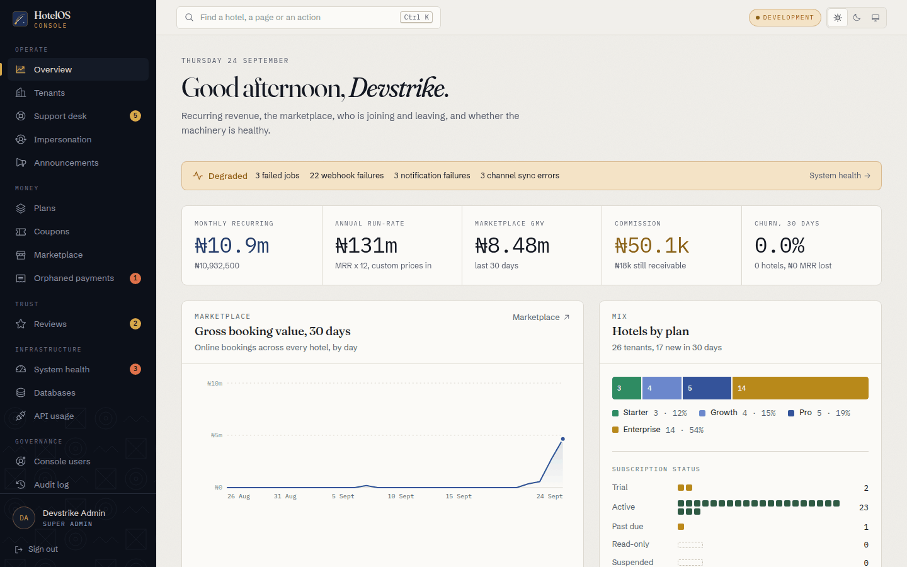
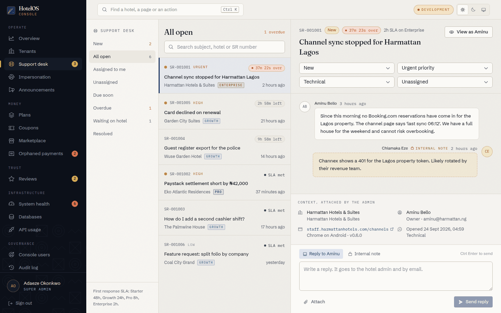
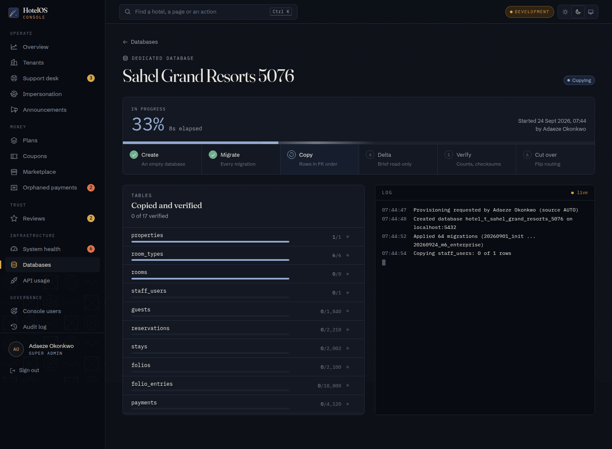
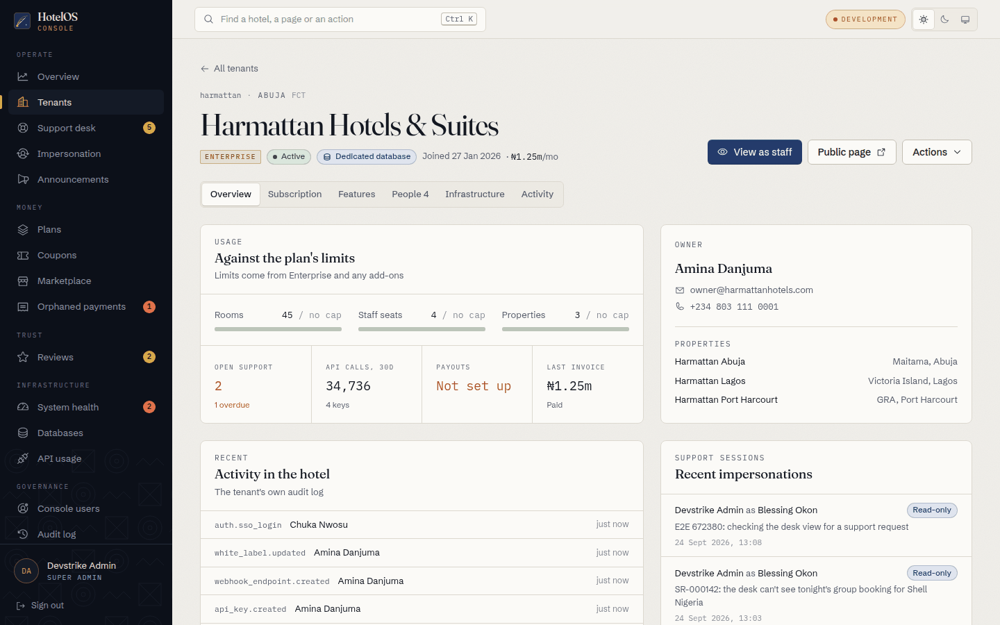
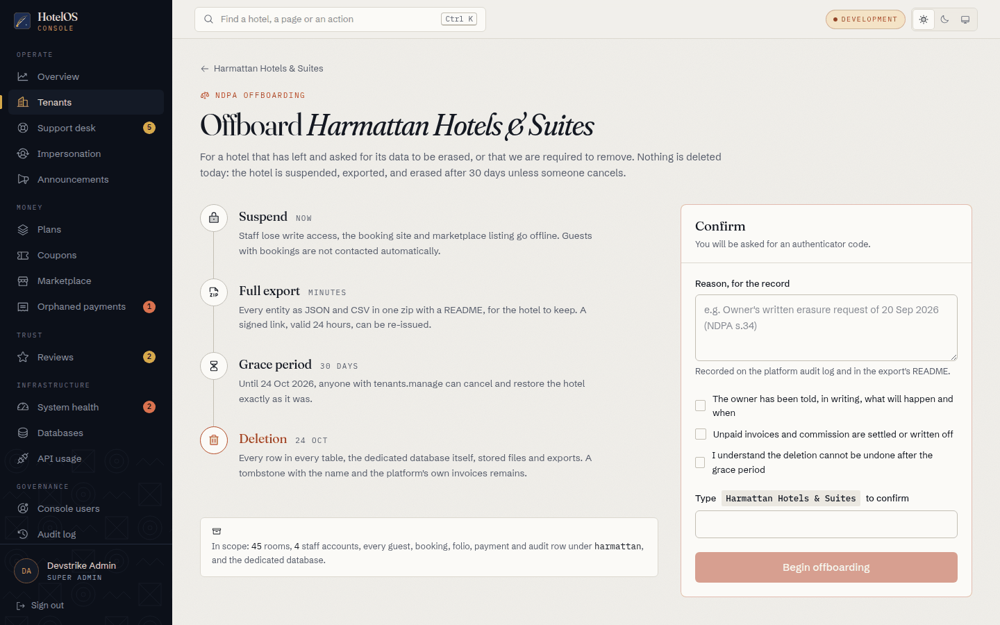
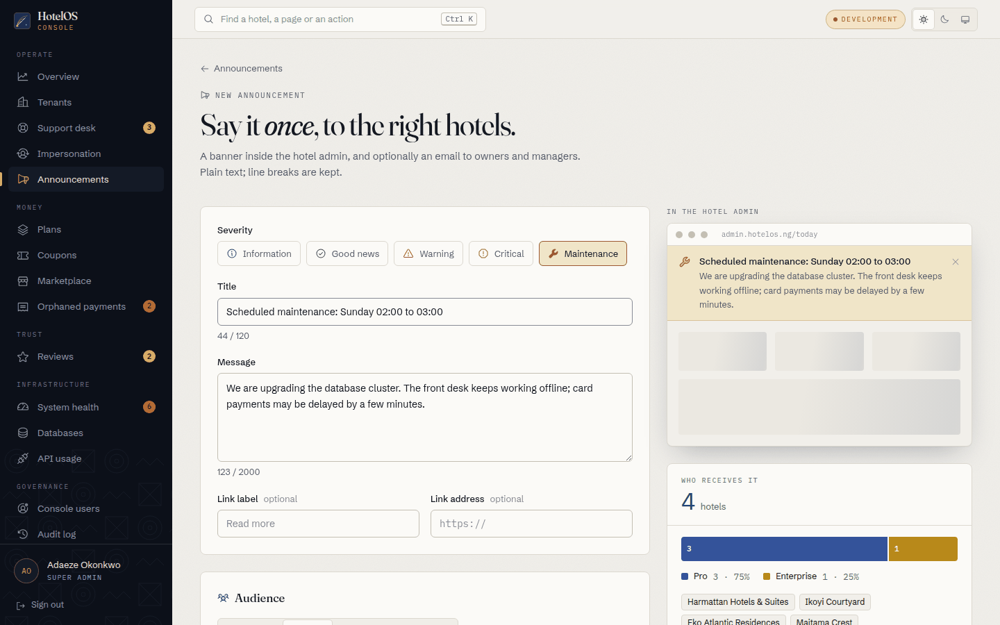
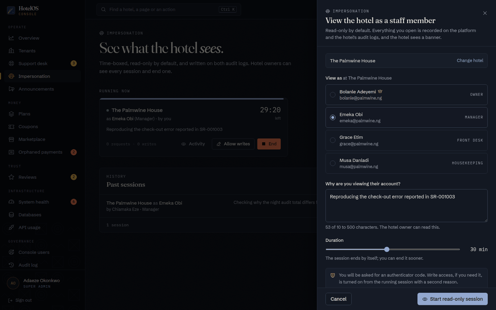
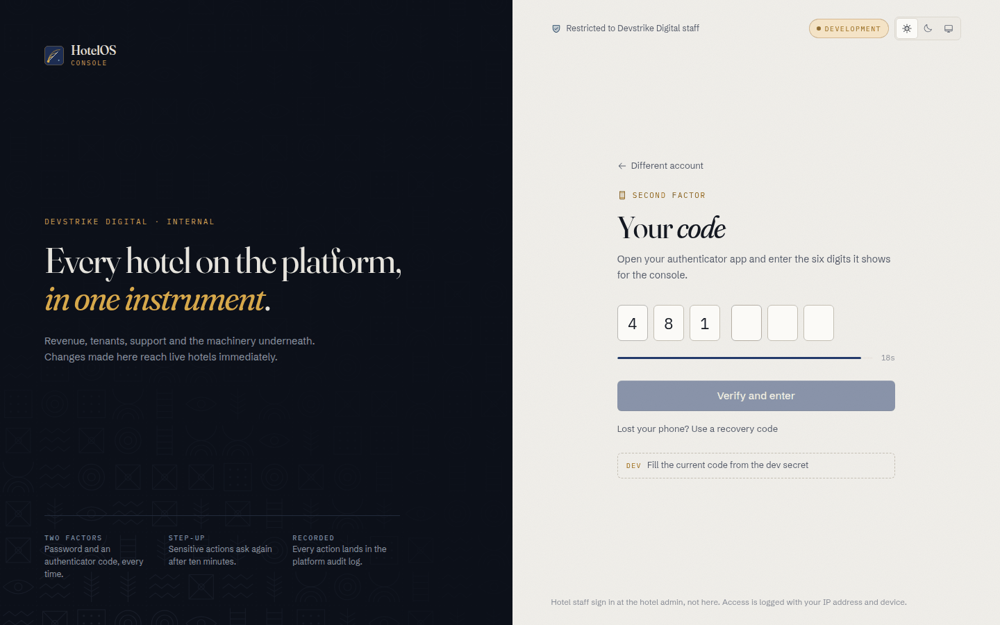
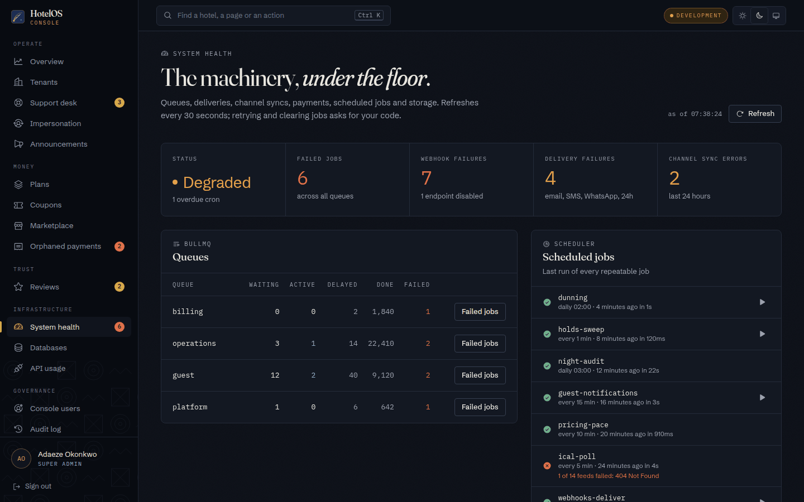

# Platform console

The operations console for the hotel management platform built by Devstrike Digital Limited. The Devstrike team uses it
every day to run the business: revenue and churn, tenants and their contracts, support, impersonation, announcements,
the machinery underneath (queues, deliveries, crons, databases) and the people who may use the console at all.

It is a separate product from the hotel admin, deployed on its own private host, with its own sign-in (password and a
mandatory authenticator), its own JWT audience and its own identity: **Adire Night**. The product name is not final:
it is read from `NEXT_PUBLIC_APP_NAME` everywhere and never hard-coded.



| | |
|---|---|
|  |  |
|  |  |
|  |  |
|  |  |

Every page at 1440px and 390px, light and dark, is in [`docs/screenshots`](docs/screenshots). They were taken against the live API and its M6 seed (the
provisioning, impersonation and offboarding flows ran for real on throwaway Enterprise tenants), so the lists also
show rows that the end-to-end tests leave behind.

## Stack

Next.js 16 (App Router) with TypeScript, Tailwind CSS v4 (CSS-first tokens, no default palette), TanStack Query,
Radix primitives restyled from scratch, `cmdk` for the command palette, Phosphor icons, `uqr` for QR codes drawn
locally, Fraunces / Schibsted Grotesk / IBM Plex Mono from `next/font`. Playwright for end-to-end tests. pnpm.

## Setup

```bash
pnpm install
cp .env.example .env.local      # then adjust
pnpm dev                        # http://localhost:3002
```

The API (`hotel-management-backend`, :4000) must be running with the M6 seed. Sign in as `admin@devstrike.ng` /
`Admin1234!`; the authenticator secret for that seeded account is `DEVSTRIKEADMINTOTPSECRET234567AB` (development
only; other seeded users and their secrets are in the API's `API-M6.md`, section 1.5). With
`NEXT_PUBLIC_DEV_TOTP_SECRET` set, the sign-in screen offers a dashed **Dev** button that fills the email, then the
current code. Production builds never show it.

### Scripts

| | |
|---|---|
| `pnpm dev` | Development server on :3002 |
| `pnpm build` / `pnpm start` | Production build and server on :3002 |
| `pnpm lint` | ESLint (Next core web vitals + TypeScript + React compiler rules) |
| `pnpm typecheck` | `tsc --noEmit` |
| `pnpm test:e2e` | Playwright against the dev server and the live API |

### Environment

| Variable | | Example |
|---|---|---|
| `NEXT_PUBLIC_APP_NAME` | Product name in titles, wordmark and copy | `HotelOS` |
| `NEXT_PUBLIC_APP_DOMAIN` | Product domain (slugs, previews) | `hotelos.ng` |
| `NEXT_PUBLIC_SUPPORT_EMAIL` | Support address | `support@hotelos.ng` |
| `NEXT_PUBLIC_API_URL` | The platform API | `https://api.hotelos.ng` |
| `NEXT_PUBLIC_ADMIN_URL` | Hotel admin; impersonation sessions open there | `https://admin.hotelos.ng` |
| `NEXT_PUBLIC_WEB_URL` | Guest site (public hotel pages) | `https://hotelos.ng` |
| `NEXT_PUBLIC_CONSOLE_ENV` | `development`, `staging` or `production`: the chip in the top bar | `production` |
| `API_INTERNAL_URL` | *Server only.* Private address the console server uses to reach the API; defaults to `NEXT_PUBLIC_API_URL` | `http://api.internal:4000` |
| `TRUSTED_PROXY_SECRET` | *Server only.* Same value as the API's; lets it trust the client IP this server forwards | 16+ characters |
| `PLATFORM_PROXY_KEY` | *Server only, optional.* Sent as `X-Platform-Proxy-Key` so the API can accept platform calls only from this server | random |
| `PLATFORM_PUBLIC_ORIGIN` | *Server only, recommended in production.* The console's public origin(s), comma-separated; a write's `Origin` must be one of them. Unset: the host the request came through (`X-Forwarded-Host` or `Host`, with `X-Forwarded-Proto`) | `https://console.hotelos.ng` |
| `NEXT_PUBLIC_DEV_*` | Development sign-in helpers, ignored by production builds | |

## Security model

The console can change what every hotel on the platform may do, so it is built as if it will be attacked.

**The browser never talks to the API.** Every call goes to this app's own `/api/*` route handler
(`src/app/api/[...path]/route.ts`), which forwards it from the server:

- **Tokens never reach JavaScript.** Access and refresh tokens returned by `platform/auth/*` are moved into
  `HttpOnly; SameSite=Strict` cookies (with the `__Host-` prefix and `Secure` in production) and stripped from the JSON
  the page sees. An injected script has nothing to steal. Refresh happens on the server, transparently; a reused
  refresh token ends the session (the API revokes the whole family).
- **Only platform routes pass.** The handler forwards `platform/*` and a few public reads, refuses dot segments, and
  in production never forwards the API's development helpers (`.../dev/...`).
- **CSRF is closed twice**: writes need an `X-Console-Request` header, which a cross-site form cannot send, and an
  `Origin` that is the console's public origin (`PLATFORM_PUBLIC_ORIGIN`, or else the host the request came through:
  `X-Forwarded-Host` / `Host` with `X-Forwarded-Proto`), never the address the Node server listens on, so it works
  behind a proxy or in a container (`src/lib/server/origin.ts`, tested in `e2e/origin.spec.ts`); the cookies are
  `SameSite=Strict` besides.
- **The real client IP** travels as `X-Client-IP`, vouched for by `X-Proxy-Auth = TRUSTED_PROXY_SECRET`. Per-user IP
  allowlists, lockouts and rate limits depend on it. The handler takes the *last* `X-Forwarded-For` hop (the one your
  own edge added), never the first.
- **Origin separation.** The API only lets `PLATFORM_ORIGINS` call `/api/v1/platform/*` from a browser, and refuses
  hotel origins outright. Since the console calls server to server, set `PLATFORM_ORIGINS` to the console's origin and
  put the API's platform routes behind a network rule or `PLATFORM_PROXY_KEY` if you want them unreachable from
  anywhere else.

**Signing in** takes a password and a six-digit code from an authenticator (TOTP, mandatory for everyone). First
sign-in, or after a reset, pairs the app from a QR code drawn in the browser (the `otpauth://` URI with the secret is
never sent to a QR service) and shows ten single-use recovery codes once, with copy, download and print, behind an "I
stored them" tick. Five wrong passwords or codes lock the account for 15 minutes.

**Step-up.** Sensitive actions (impersonation, write mode, offboarding, provisioning, queue retry and clear, running
jobs, resetting someone's 2FA, changing roles and allowlists, new recovery codes, password changes) need a code entered
in the last ten minutes. Pages never decide this: the API answers `403 STEP_UP_REQUIRED`, the client
(`src/lib/api/client.ts`) pauses the request, the step-up dialog asks for a code (or a recovery code), and the request
is retried. A green "Verified 8:42" chip in the top bar shows how long the step-up lasts.

**Sessions** last 12 hours, end after an hour idle, and are listed in *Account and security* with device, IP and last
activity; any can be ended, or all but this one.

**Headers.** A strict content security policy (`connect-src 'self'`: the page can only talk to its own server),
`frame-ancestors 'none'`, `X-Frame-Options: DENY`, `Referrer-Policy: no-referrer`, a closed `Permissions-Policy`,
`X-Robots-Tag: noindex`, HSTS in production. See `next.config.ts`.

**Permissions.** Every page and action is gated by the signed-in person's permissions (from `/platform/auth/me`),
and the API enforces them regardless:

| | Super admin | Operations | Support | Finance | Sales (read-only) |
|---|---|---|---|---|---|
| Tenants: view / manage | yes / yes | yes / yes | yes / | yes / | yes / |
| Plans and coupons | edit | | | edit | read |
| Billing: view / manage, settle commission | yes | view | | yes | view |
| Impersonate | yes (owners too) | yes | yes | | |
| Announcements | yes | yes | | | |
| Support desk | yes | yes | yes | | |
| Reviews moderation | yes | yes | yes | | |
| System health | yes | yes | yes | | |
| Dedicated databases | yes | yes | | | |
| Console users | yes | | | | |
| Audit log | yes | yes | | yes | |

Everything the console does is written to the platform audit log (append-only in the database), viewable and
exportable as CSV or JSON from *Audit log*.

## Deploying on a private host

The console is meant to live on its own host, for example `console.hotelos.ng`, reachable only by Devstrike staff.

1. **Build**: `pnpm install --frozen-lockfile && pnpm build`, then run `pnpm start` (port 3002) under a process
   manager (systemd, pm2) or in a container (`node:22-alpine`, copy `.next`, `public`, `package.json`, `node_modules`).
   Set the environment above at build time for `NEXT_PUBLIC_*` values and at run time for the server-only ones.
2. **Restrict the host** in front of the app: a VPN, Cloudflare Access / Zero Trust, or an IP allowlist at the load
   balancer. The console's own sign-in and per-user IP allowlists are the second and third locks, not the first.
3. **TLS** at the edge (Caddy, nginx or the load balancer). Production cookies are `Secure` and `__Host-` prefixed, so
   plain HTTP will not keep a session.
4. **The edge must append the client address** to `X-Forwarded-For` (Caddy and nginx do with the usual
   `proxy_set_header X-Forwarded-For $proxy_add_x_forwarded_for`). The console forwards the last hop to the API.
5. **API side**: set `PLATFORM_ORIGINS=https://console.hotelos.ng`, the same `TRUSTED_PROXY_SECRET` on both, and
   point `API_INTERNAL_URL` at the API's private address so console traffic never leaves your network.
6. `robots` is `noindex` and the app sends `X-Robots-Tag`; do not link to it from anywhere public.

## Pages

| Route | |
|---|---|
| `/login` | Password, then the authenticator code (six cells, paste-friendly, a bar for the 30-second window); recovery codes; first-time pairing with a locally drawn QR code, the key grouped in fours, and the recovery-code sheet |
| `/invite/[token]` | Accepting an invitation: name, password, then pairing the authenticator |
| `/` | **Overview**: health strip, MRR, ARR, marketplace GMV, commission (collected and receivable), 30-day churn; GMV by day; hotels by plan and status; signups by week; trials ending this week; hotels lost by month |
| `/tenants` | Search, plan, status, database and sort filters kept in the URL; cards on phones |
| `/tenants/new` | **Enterprise onboarding**: hotel, owner, plan, billing, custom price, contract dates and notes, trial or active, with a live contract summary (monthly value, term, contract value); the owner's set-up link |
| `/tenants/[id]` | Header with plan, status, database; *View as staff*; actions to extend the trial, suspend or reinstate with a reason, export all data, offboard. Tabs: overview (usage against limits, support, API calls, payouts, owner, properties, activity, recent impersonations), subscription (plan, status, interval, custom price, contract, coupon, invoices), features and add-ons, people (view as any staff member), infrastructure (dedicated database, domains, white-label, SSO, partner API usage, exports), activity |
| `/tenants/[id]/offboard` | **NDPA offboarding**: what happens and when (suspend, full export, 30-day grace, deletion), reason, three acknowledgements, typing the tenant's name (paste disabled), step-up. The tenant page then shows the export progress, the deletion date and *Cancel* |
| `/support` | **Support desk**: views (new, open, mine, unassigned, due soon, overdue, waiting on hotel, resolved) with counts, SLA clocks by plan (2h Enterprise to 48h Starter) that turn ochre when due soon and laterite when breached, the thread with internal notes set apart, context the admin attached (page, device, app version, role), status, priority, category and assignee, replies with attachments, and *View as* the requester |
| `/impersonation` | Running sessions with a countdown bar, *Allow writes* (a second, audited reason), back to read-only, end; past sessions with what was opened; the **launcher**: hotel, staff member (owners only for super admins), reason, duration, step-up, then a one-time link into the hotel admin that is good for two minutes |
| `/announcements`, `/announcements/new` | Live, scheduled, drafts and ended, with reach (hotels, emails, seen, dismissed) and per-hotel stats; the **composer** with severity, audience (all, plans, cities, specific hotels), window, channels, dismissible, link, a preview of the banner inside the hotel admin and a live audience preview (count, plan mix, sample hotels) |
| `/plans` | Prices, limits, commission, features per plan; read-only without `plans.manage` |
| `/coupons` | Coupons as ticket stubs: discount, duration, plans, uses against the cap, validity; create, pause, see who used one |
| `/marketplace` | GMV, commission collected and receivable, bookings by channel and payment, commission by hotel, pay-at-hotel receivables by month with *Settle* |
| `/payments/orphaned` | Guest money that could not be applied, with the reason and a refund retry |
| `/reviews` | Moderation queue: flagged, live, hidden; hide with a reason and note, keep, restore |
| `/system` | **System health**: status, BullMQ queues with failed jobs (inspect, retry or clear, selected or all, behind step-up), scheduled jobs with last run, duration and *Run now*, email/SMS/WhatsApp deliveries by provider and recent failures, outbound webhook failures, channel sync errors, the Paystack webhook log, database size per tenant (measured for dedicated, estimated for shared) |
| `/databases`, `/databases/[tenantId]` | Dedicated database registry and candidates; **provisioning, live**: percentage and elapsed time, the six steps, the read-only window as it happens, every table's copy progress and checksum, and a streaming log; afterwards rollback (until the shared copy is purged) and purge now; *Migrate every database* for super admins |
| `/api-usage` | Partner API requests, writes, errors and 429s; by day and by tenant |
| `/users` | Console users: invite (link and email), role, 2FA state, lock, IP rules, sessions; reset 2FA, unlock, resend, deactivate |
| `/audit` | The platform audit log with filters, expandable rows (request, IP, device, session, redacted body) and CSV/JSON export |
| `/account` | Your sessions, recovery codes left and new ones, password, your own IP allowlist |

Anywhere: **Ctrl K** (or `/`) opens the command palette: hotels by name, every page you may open, and actions (new
Enterprise tenant, new announcement, start an impersonation). The top bar shows the environment (*Development*,
*Staging*, or *Live* in brass) and the step-up countdown.

## Design: Adire Night

Same family as the hotel admin (Fraunces for display with its optical size axis, Schibsted Grotesk for UI, IBM Plex
Mono for every figure, hairlines rather than shadows, a paper grain), but unmistakably another place:

- **Adire indigo** is the primary accent (buttons, links, selection, focus rings), after the Yoruba resist-dyed cloth.
- **Brass** marks what matters: the active page, key figures, notes that only Devstrike sees, *Live*.
- **Night** is the sidebar and the login panel, the same ink in both themes, with a quiet adire cloth motif.
- **Laterite** appears only for danger and money at risk: destructive actions, breached SLAs, failed refunds.
- The mark is an adire-dyed tile with brass arcs, a dial rather than the admin's key fob.
- Charts are drawn in-house in SVG (area with crosshair, columns, share bars, unit rows, rank bars) with a hidden table
  for screen readers. The categorical palette was checked with a colour-vision validator in both themes.
- Light and dark follow the system, with a manual toggle stored in `localStorage` (guarded).
- No emoji anywhere.

## End-to-end tests

```bash
pnpm test:e2e      # Chromium from /opt/pw-browsers (or PW_CHROMIUM_PATH)
```

Runs against the dev server on :3002 and the live API on :4000 with the M6 seed:

- sign in with password and a TOTP computed from the seeded secret; tokens are in httpOnly cookies, invisible to
  scripts; sign out; a wrong code is refused; a code used twice (`MFA_CODE_ALREADY_USED`) shows a calm "wait for the
  next code" note, not a failure;
- step-up on a sensitive action (new recovery codes);
- create an Enterprise tenant with a custom price;
- post an announcement to Pro and Enterprise hotels;
- reply to a support request;
- start a read-only impersonation session behind step-up, check the one-time handoff link, end it;
- retry a failed job behind step-up;
- provision a dedicated database for a new Enterprise tenant and wait for it to go active.

A setup project signs in once and shares the cookies. The API refuses a code twice, so the helpers wait for the next
30-second window when a code has been used. To exercise step-up, the tests age the session's step-up in the
development database (`E2E_DATABASE_URL`, default the local `hotel` database). Other overrides: `E2E_BASE_URL`,
`E2E_EMAIL`, `E2E_PASSWORD`, `E2E_TOTP_SECRET`. The tests write real rows (tenants, an announcement, a reply, a
provisioned database) to the development data.

## Layout

```
src/app/(auth)          sign-in, invitation
src/app/(console)       every console page (shell with navigation and palette)
src/app/api/[...path]   the gateway to the API (cookies, CSRF, client IP)
src/components          by section; ui/ for the kit, security/ for OTP, QR, recovery codes and step-up
src/lib/api             client (step-up broker), endpoints, hooks, types (M6 contract)
e2e                     Playwright
```

## Docker and deploy

**Whole stack.** The backend repo runs the console with the API, worker, database and the other two apps:
`docker compose -f docker-compose.full.yml up --build` in `hotel-management-backend` (see its README, "Run everything
with Docker"). This repo must sit next to it as `../hotel-management-platform`. Open the console at
`http://localhost:3002` (not `127.0.0.1`); sign in with `admin@devstrike.ng` / `Admin1234!` and a TOTP code.

**This image alone.** `Dockerfile` builds the Next.js standalone output on `node:22-alpine` and runs `node server.js`
as the `node` user on port 3002 (`PORT` overrides). `NEXT_PUBLIC_*` are build arguments; `API_INTERNAL_URL`,
`TRUSTED_PROXY_SECRET` and `PLATFORM_PROXY_KEY` are read at run time.

```bash
docker build -t hotel-platform --build-arg NEXT_PUBLIC_API_URL=https://api.example.com .
docker run -p 3002:3002 -e API_INTERNAL_URL=http://api:4000 -e TRUSTED_PROXY_SECRET=... hotel-platform
```

The gateway's CSRF check compares the browser's `Origin` with the origin Next derives from the server, which in a
container is `http://localhost:<PORT>` (the Dockerfile makes the standalone server bind without a hostname, as
`next start` does). So publish the same port the container listens on and browse to `localhost`. Self-hosting the
image behind a real domain (a reverse proxy) needs the check to use the forwarded host first (open item in the
backend's `docs/deploy.md`); on Vercel the derived origin is the real one. Sessions use `__Host-` cookies, so
anything but `localhost` needs HTTPS. Behind a TLS-inspecting proxy, pass its CA as the optional build secret
`extra_ca`.

**Vercel.** `vercel.json` pins pnpm and the function region (`lhr1`, next to the API). Turn on Deployment Protection
for this project. Variables: `docs/deploy.md` in the backend repo.
